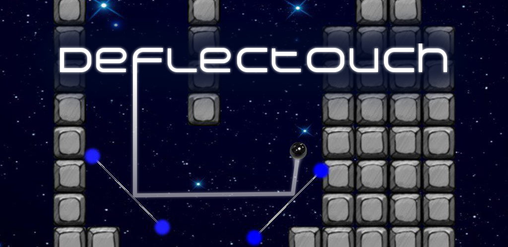
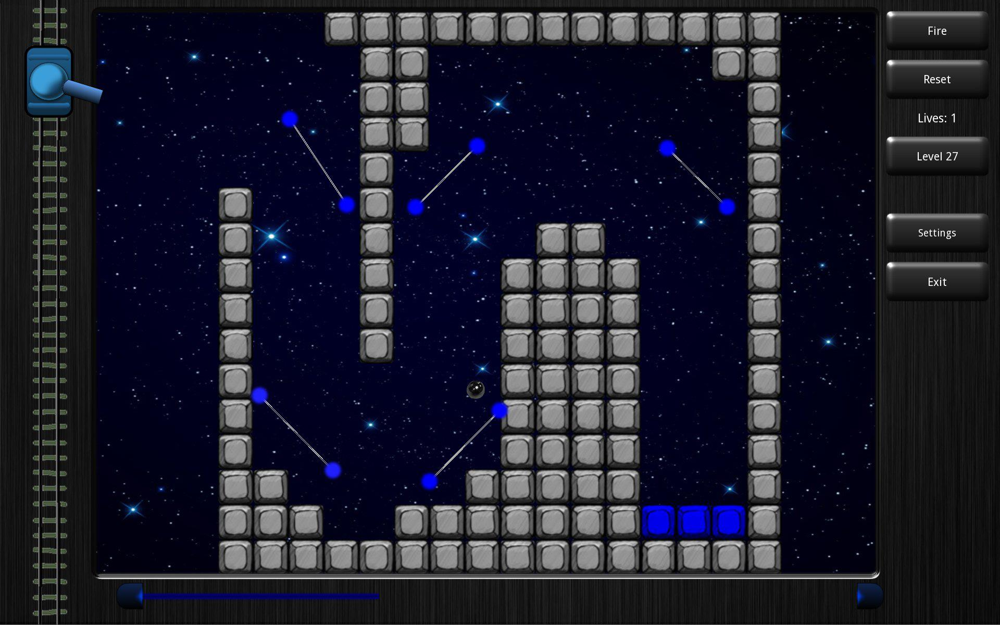
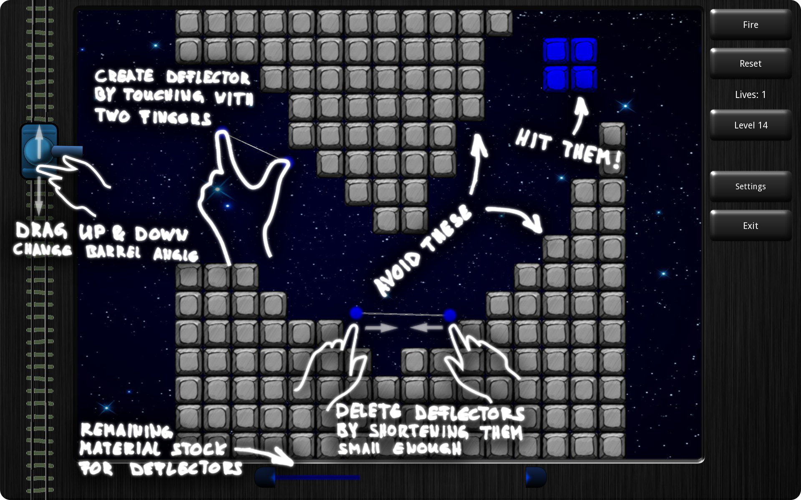
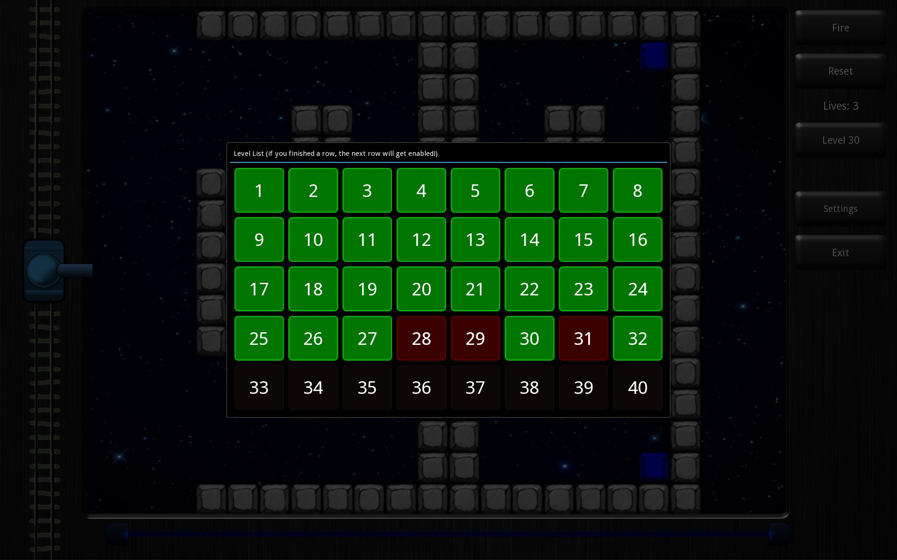
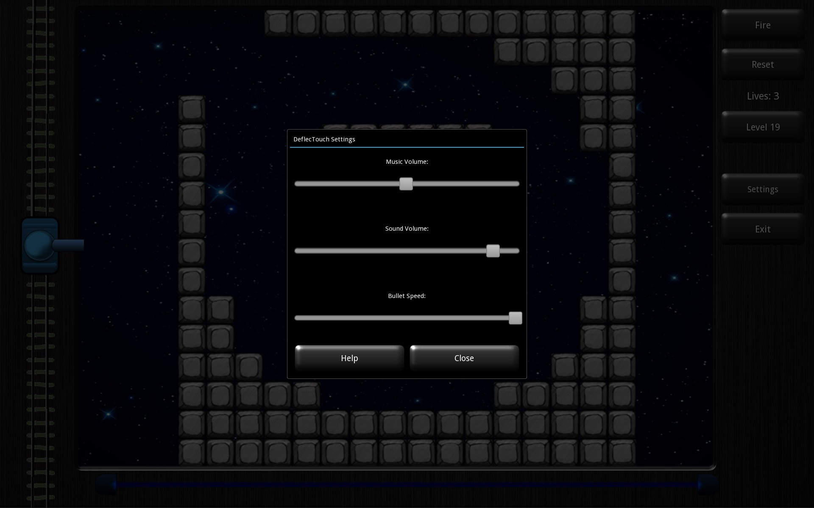

Deflectouch
==============

**[Youtube video](http://www.youtube.com/watch?v=1Qa98oSPgi0)**

**[Thread on NUI-group](http://nuigroup.com/forums/viewthread/13600/)**

READ THIS FIRST
---------------

This application runs on the open source multitouch framework <Kivy>.
For informations on the Kivy framework, please refer to http://kivy.org

To install Kivy on your computer, see the Kivy documentation at
http://kivy.org/docs/installation/installation.html

...or, for windows, read the section "Getting Started under Windows" which is a
heavily summarized version of the above one.

Copyright and Contact
---------------------

Deflectouch Copyright (C) 2012 2015 Cyril Stoller

This program comes with ABSOLUTELY NO WARRANTY. This is free software,
and you are welcome to redistribute it under certain conditions;
see the source code for details.

For comments, suggestions or other messages contact me at:
cyril.stoller@gmail.com

Credits
-------

* Sound:
  * beep.ogg, reset.ogg, select.ogg and switch.ogg are from the game *GUNSHIP!* from Microprose
  * All other sound files are created by myself
* Music:
  * The deflectouch.ogg song is created by myself
* Images:
  * www.gestureworks.com

Release Notes
-------------

Release history:

* **V1.1**: *bug fixes, preparations for release on Google Play Store*
* **V1.0**: *first released version*

